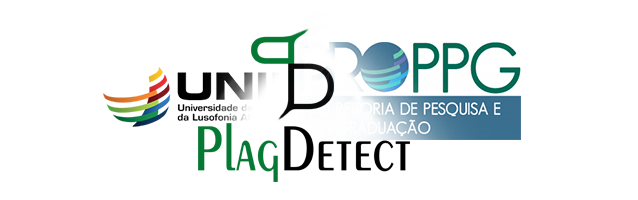

<h1 align="center">
  
</h1>

PlagDetect é um projeto que tem como principal função a detecção de plágio em trabalhos submetidos por pesquisadores de uma determinada instituição. Tal análise funciona a partir da base de dados dos projetos de pesquisa já submetidos em até três anos anteriores, em que todos os projetos são comparados e analisados com o que está sendo submetido pelo usuário.

Atualmente(20/05/2021) o PlagDetect encontra-se hospenado no <a href="https://www.pythonanywhere.com/">Pythonanywhere<a> podendo ser acessado no seguinte link: <a href="https://tinyurl.com/PlagDetectCPQ">PlagDetect<a>. Mas logo-logo a aplicação será hospedada nos servidores da Universidade da integração internacional da lusofonia Afro-brasileira(UNILAB)

Para ter um conhecimento mais visual da aplicação, assista o seguinte vídeo no canal da PROPPG Unilab: <a href="https://www.youtube.com/watch?v=3OhTAW-LZkI">VÍDEO<a>
<h2 align="center">Desenvolvedores:</h2>
<table align="center">
  <tr>
    <td align="center">
      Antonio Paulo Uamba &logo=<LOGO>">
    </td>
    <td align="center">
      Allberson Bruno de Oliveira Dantas&logo=<LOGO>">
    </td>
     <td align="center">
       Renato Farias de Paiva &logo=<LOGO>">
    </td>
     <td align="center">
       Pedro Bruno Silva Lemos &logo=<LOGO>"></a>
    </td align="center">
    <td align="center">
       Lucas da Silva Maciel &logo=<LOGO>">
    </td>
  </tr>
</table>

<h1>Sobre a Aplicação(DEV):</h1>

Uma boa parte da aplicação foi desenvolvida na linguagem de programação Python. Ou seja, toda sua estrutura de análise de projetos, leitura de arquivos em PDF e lançamento de resultados. Porém, para que fosse possível publica-la na web, recorremos a dois FrameWorks bastante utilizados pela comunidade dev: <a href="https://flask.palletsprojects.com/en/2.0.x/">Flask</a> e <a href="https://getbootstrap.com/">Bootstrap</a>. Alem disso, o JavaScript foi utilizado para algumas funcionalidades, como por exemplo: sistema de alerta e gerador de um comprovante, para que seja possível ser imprimido após a análise. Além disso, Utilizamos o MySQL para pudessemos desenvolver um banco de dados que armazenase dados de usuários restritos na aplicação

